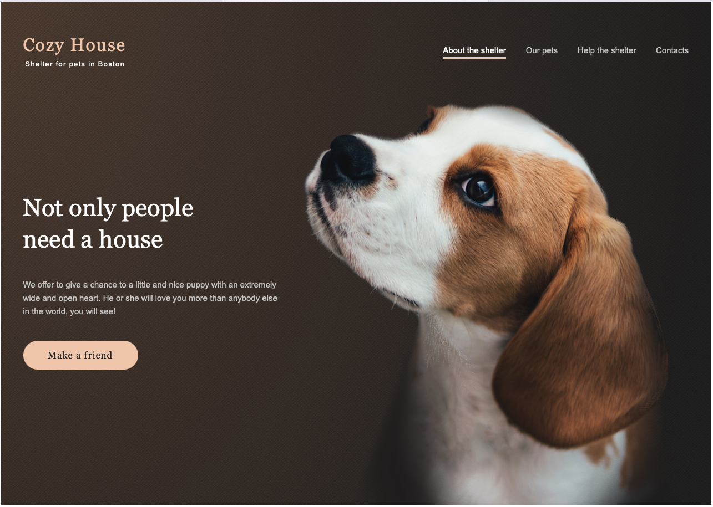
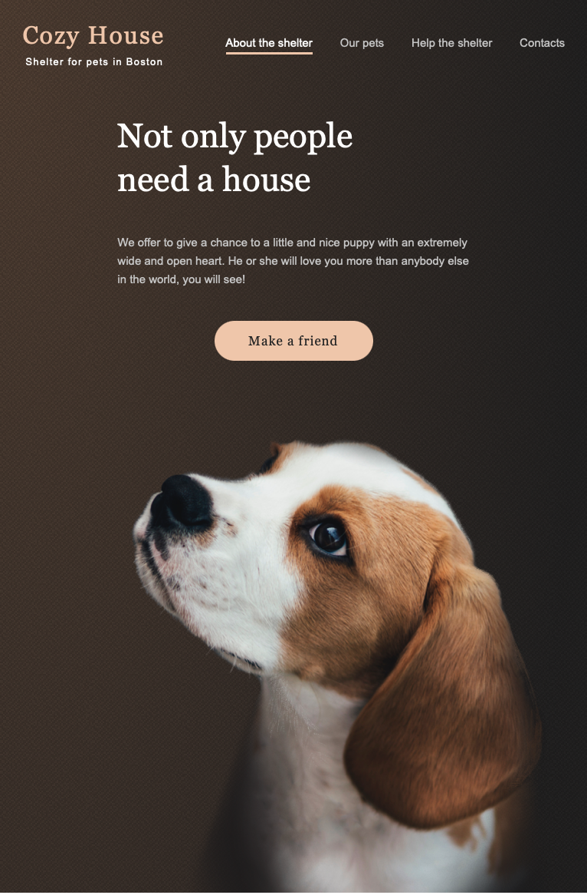
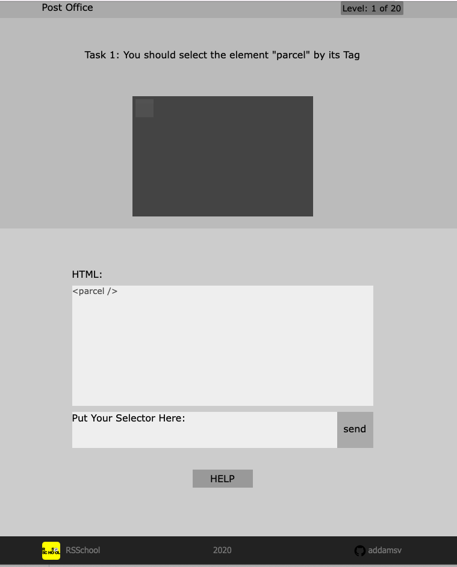
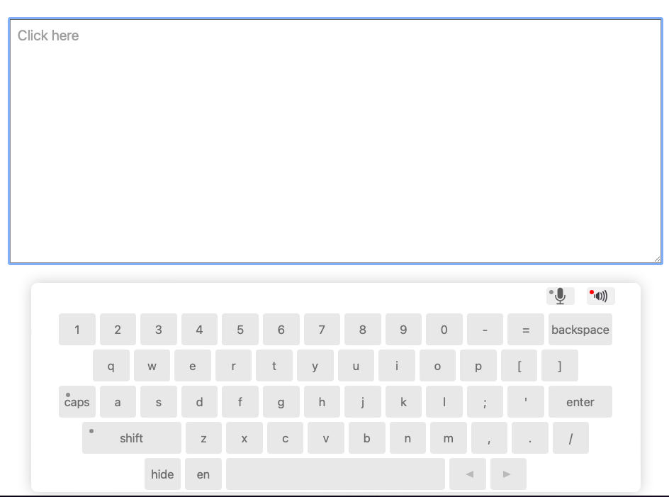

<h3 align="center">The Covide Dashboard Dec. 2020</h3>

  <b>Stack:</b> RWD layouts, CoreJS, Git 
  <b>Responsibility:</b> Team lead.  Settings of whole project; features:  map, keyboard, list of countries 
  (Team project. 2 participants. Elizaveta Panasiuk: https://github.com/ElizavetaPanasiuk) 

   
    
  
  </a>
   

   
  

<h3 align="center">The Momentum. 2020</h3>

  <b>Stack:</b> RWD layouts, CoreJS, Git 

   
    
  
  </a>
   

   

  

<h3 align="center">The Gem Puzzle. 2020</h3>

  <b>Stack:</b> RWD layouts, CoreJS, Git 

   
    
  
  </a>
   

   

<h3 align="center">The Shelter. 2020</h3>

  <b>Stack:</b>Pixel Perfect RWD layouts, CoreJS, Git 

    
  
  </a>
   

   
  

<h3 align="center">The RS CSS. 2020</h3>

  <b>Stack:</b> RWD layouts, CoreJS, Git 

   
    
  
  </a>
   

   

<h3 align="center">The Calculator. 2020</h3>

  <b>Stack:</b> RWD layouts, CoreJS, Git 

  
   
    
  
  </a>
   

   

<h3 align="center">The Virtual Keyboard. 2020</h3>

  <b>Stack:</b> RWD layouts, CoreJS, Git 

    
  
  </a>
   

   

<!--
# Momentum

[Приложение](https://addamsv.github.io/rsschooll/momentum/)

  

# Calculator

[Приложение](https://addamsv.github.io/calculator/)

  

# Gem-Puzzle

[Приложение](https://addamsv.github.io/rsschooll/gem-puzzle/)
//-->
