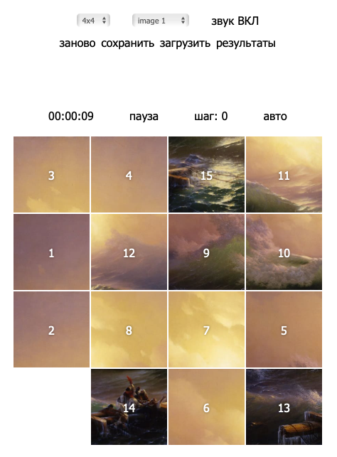
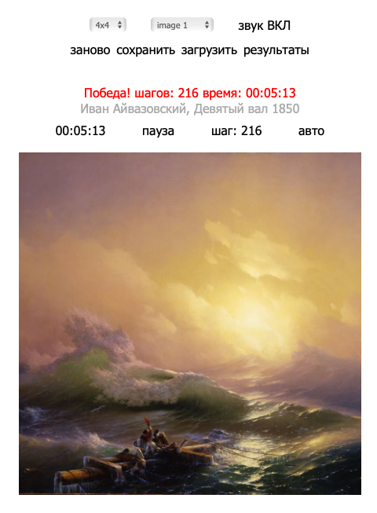

# *The Gem Puzzle*
[задание](https://github.com/rolling-scopes-school/tasks/blob/master/tasks/gem-pazzle/codejam-the-gem-puzzle.md) 
[приложение](https://addamsv.github.io/rsschooll/gem-puzzle/)

**Максимальный балл за задание: 170 баллов при cross check / 210 баллов при проверке ментором**   

### Basic scope +30 
- [x] вёрстка, дизайн, UI: `+10`
- [x] состояние игрового поля генерируется случайным образом: `+10`
- [x] при клике по фишке, стоящей рядом с пустой клеткой, фишка перемещается на место пустой клетки: `+10`

### Advanced scope +60

- [x] игру можно начать заново без перезагрузки страницы: `+10`
- [x] отображается время игры и количество ходов: `+10`
- [x] фишки можно перетягивать мышкой: `+10`
- [x] реализовано сохранение состояния игры и сохранение 10 лучших результатов с использованием LocalStorage: `+10`
- [x] реализован выбор размера поля: `+10`
- [x] звуковое сопровождение передвижения фишек: `+10`

### Hacker scope +80
- [x] анимация перемещения пятнашек на поле: `+10`
- [x] когда игра закончилась, выводится сообщение с затраченным на игру временем и количеством ходов: `+10`
- [x] вместо цифр используются картинки: `+30`
- [x] автоматическое, анимированное завершение игры: `+30`

### Технические (проверяются ментором):
- [x] подключен и используется `eslint`, : `+10`
- [x] подключен и используется `webpack`, : `+10`
- [x] приложение разбито на отдельные модули, используются фишки `es6` и выше (на усмотрение ментора): `+20`

### Штрафы:
- [ ] Ошибки в консоли, связанные с исполняемым кодом(ошибки типа favicon.ico: Failed to load resource: the server responded with a status of 404 не учитываются): `-15`
- [ ] ошибки `eslint`: `-10`
